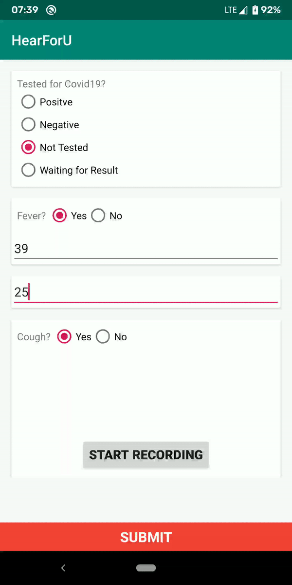

# Hear For U
This application is made for COVID-19 detection showcasing on the [Skillenza Hackathon](https://skillenza.com/challenge/coders-vs-covid-onlinehackathon).

## Layout
The application contains a training screen and a testing screen. The model resides in assets. Each new update for model is by newer release.

### Screenshots

### Recording Layout
The app is tailored to collect data if user wants. No login needed for testing and providing training data.

